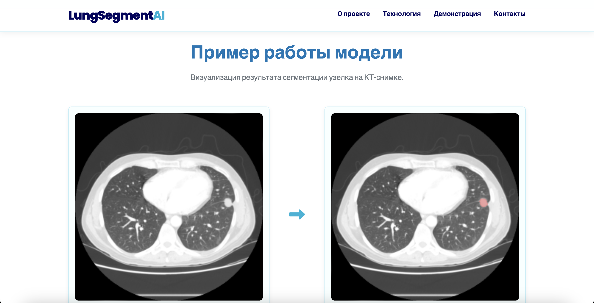

# LungSegment AI - Сайт-визитка проекта

Одностраничный адаптивный сайт-визитка, представляющий проект **LungSegment AI**. Цель проекта — разработка и обучение нейросети (архитектуры U-Net) для автоматической сегментации (выделения границ) узелков в легких на медицинских КТ-снимках.

## ✨ Описание сайта

Этот репозиторий содержит код для сайта-визитки проекта LungSegment AI. Сайт выполняет следующие функции:

* Представляет **цели и задачи** основного AI-проекта.
* Объясняет используемую **технологию** (U-Net для сегментации) простым языком.
* Демонстрирует **пример работы** (визуализация сегментации).
* Предоставляет **контактную информацию** для связи.

## 🚀 Демонстрация

Вы можете посмотреть живую версию сайта здесь:

➡️ **[Посмотреть Демо](https://neutrontype.github.io/LungSegmentAI/)** ⬅️

## 🛠️ Технологии

Сайт создан с использованием следующих веб-технологий:

* **HTML5:** Семантическая разметка структуры сайта.
* **CSS3:**
    * Flexbox и Grid Layout для построения адаптивных макетов.
    * CSS переменные для управления темой.
    * Плавные переходы и анимации (включая анимацию появления при прокрутке).
    * Адаптивный дизайн (Media Queries).
* **JavaScript (Vanilla JS):**
    * Манипуляция DOM (для мобильного меню).
    * Intersection Observer API для запуска анимаций при прокрутке.
    * Плавная прокрутка к секциям сайта.
* **Font Awesome:** Для векторных иконок.
* **Google Fonts:** Для подключения шрифтов (Poppins, Lato).

